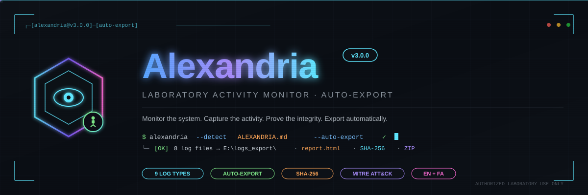

<div align="center">



<br>

<h1>⚡ Alexandria</h1>

<p><strong>Monitor the system. Capture the activity. Prove the integrity. Export automatically.</strong></p>
<p>A bilingual, laboratory-grade activity monitor for authorized cybersecurity education — with auto-export on authorized USB drives, 9 log types, and professional HTML forensics dashboards.</p>

<a href="#-english"></a>
<a href="#-فارسی"></a>

</div>

[](https://www.microsoft.com/windows)
[](https://www.python.org/)
[](LICENSE)
[]()

[](#version-history)
[](#auto-export-feature)
[](#)
[](#)
[](#)
[](#)

> A bilingual, laboratory-grade activity monitoring tool for authorized cybersecurity training — capturing 9 log types with auto-export on authorized USB drives and professional HTML reporting.

<div align="center">

| 🎯 9 Log Types | 🌍 2 Languages | 🧠 MITRE Mapped | 🔐 Integrity Verified | 🔌 Auto-Export |
|:---:|:---:|:---:|:---:|:---:|
| `keyboard · window · browser · clipboard · process · usb · system · activity` | `EN + FA` | `7 Techniques` | `SHA-256` | `Marker File` |

</div>

<details>
<summary><strong>🎬 Open the quick-start briefing</strong></summary>

```text
┌──────────────────────────────────────────────────────────────────────┐
│   INSTALL  →  RUN SILENTLY  →  PLUG USB  →  AUTO-EXPORT  →  ANALYZE │
│      ↓             ↓              ↓             ↓            ↓        │
│   install.bat   persistence   ALEXANDRIA.md  ZIP+HTML   report.html  │
│                  (Run Key +   marker file    SHA-256    MITRE map    │
│                   Task)       detected       ZIP        insights     │
└──────────────────────────────────────────────────────────────────────┘
```

</details>

## Table of Contents

- [About](#about)
- [What's New in v3?](#whats-new-in-v3)
- [Why Alexandria?](#why-alexandria)
- [Who Is This For?](#who-is-this-for)
- [What You'll Learn](#what-youll-learn)
- [Project Stats](#project-stats)
- [How to Use This Project](#how-to-use-this-project)
- [Prerequisites](#prerequisites)
- [Features Overview](#features-overview)
- [Auto-Export Feature](#auto-export-feature)
- [Technologies and Tools](#technologies-and-tools)
- [Repository Structure](#repository-structure)
- [Deployment Workflow](#deployment-workflow)
- [Key Security Concepts](#key-security-concepts)
- [MITRE ATT&CK Mapping](#mitre-attck-mapping)
- [Sample Output](#sample-output)
- [Roadmap](#roadmap)
- [FAQ](#faq)
- [Related Resources](#related-resources)
- [Version History](#version-history)
- [Contributing](#contributing)
- [Disclaimer](#disclaimer)
- [License](#license)
- [Acknowledgments](#acknowledgments)
- [Author](#author)

## About

**Alexandria** is a laboratory-grade activity monitoring tool designed for **authorized cybersecurity training**. It runs silently on Windows systems, capturing a comprehensive picture of user and system activity — then produces a professional HTML report with SHA-256 integrity verification and a compressed ZIP archive for easy transfer.

**New in v3:** Auto-export is triggered simply by plugging in an **authorized USB drive** — one that contains a specific marker file (`ALEXANDRIA.md`) with predefined content. No manual interaction required.

Named after the legendary **Library of Alexandria** — the ancient world's greatest repository of knowledge — this tool embodies the same principle: **gather, preserve, and present information with integrity**.

## What's New in v3?

| Feature | Description |
|---------|-------------|
| 🔌 **Auto-Export** | Detects authorized USB drives and exports logs automatically |
| 📄 **Marker File Detection** | `ALEXANDRIA.md` with predefined content acts as an authorization token |
| 🛠 **USB Marking Tool** | `mark_usb.bat` tags any USB drive as authorized in one click |
| 📊 **Enhanced Reports** | HTML dashboard now includes USB events and auto-export statistics |
| 🎯 **Trigger Tracking** | Export log records whether export was `auto` or `manual` |
| 🔒 **Safer Defaults** | Only USBs with valid marker file can trigger export |

## Why Alexandria?

Most keyloggers are single-purpose toys. Most EDR tools are enterprise-heavy monoliths. Alexandria sits in between: **a teaching-grade monitoring tool** that demonstrates professional techniques without the enterprise overhead.

It was built for a cybersecurity laboratory course, with emphasis on:

- **Real-world techniques** — Persistence via Registry + Scheduled Task
- **Data integrity** — SHA-256 manifest for every log file
- **Professional reporting** — GitHub-dark HTML dashboard
- **Bilingual support** — Persian and English keyboard layouts
- **Defensive awareness** — Every feature maps to a defensive lesson
- **Auto-export on trusted media** — Marker-based USB authorization

## Who Is This For?

- **Cybersecurity students** learning monitoring fundamentals
- **Instructors** teaching digital forensics and endpoint detection
- **Pentesters** building understanding of persistence mechanisms
- **Blue teamers** studying what EDR tools capture
- **Researchers** needing a controlled data-collection baseline
- **Anyone** with written authorization to monitor a specific system

## What You'll Learn

- Implement Windows persistence (Registry Run Key + Scheduled Task)
- Build a thread-safe, multi-feature logging system in Python
- Capture keyboard input across layouts (Persian + English) with VK codes
- Extract browser history from SQLite databases in real-time
- Monitor clipboard, processes, USB events, and idle state
- **Detect authorized USB media via marker files**
- **Trigger automatic export when a trusted device is connected**
- Generate SHA-256 integrity manifests for forensic evidence
- Build a dark-mode HTML dashboard with pure CSS
- Compress forensic data with ZIP for evidence preservation
- Apply MITRE ATT&CK framework to a real tool
- Understand defensive countermeasures for each technique

## Project Stats

| Metric | Value |
|---|---|
| Log types | 9 (keylog, activity, browser, clipboard, process, usb, system, + reports) |
| Languages | English and Persian |
| Platform | Windows 10 / 11 |
| Persistence methods | 2 (Run Key + Scheduled Task) |
| Integrity | SHA-256 manifest per file |
| Report format | HTML dashboard + ZIP archive |
| Config | JSON (16 options) |
| Auto-Export | Marker file (`ALEXANDRIA.md`) |
| Single-instance | Windows Mutex |
| Author | Leo / Ilya Farahani |

## How to Use This Project

1. **Read the Disclaimer carefully** — this tool requires written authorization.
2. **Get written permission** from the system owner and your instructor.
3. **Review the source code** (`alexandria.py`) before deployment.
4. **Test on your own machine first** using the provided scripts.
5. **Mark your USB** with `mark_usb.bat` before going to the lab.
6. **Deploy on the authorized target** via `install.bat` (Run as admin).
7. **Wait the monitoring period** — no USB needed during this time.
8. **Plug in the marked USB** on the final day — auto-export happens.
9. **Analyze** `report.html` and raw logs.
10. **Uninstall cleanly** with `uninstall.bat` after evaluation.

## Prerequisites

**Required:**
- Windows 10 or Windows 11 (x64)
- Administrator access on the target system
- Python 3.10+ (for building from source)
- Written authorization for the target system
- A USB flash drive (to be marked as authorized)

**Recommended:**
- Basic Python knowledge
- Familiarity with Windows Registry
- Understanding of Windows Task Scheduler
- A modern browser (for viewing `report.html`)

## Features Overview

| # | Feature | Description | Config Key |
|---|---------|-------------|------------|
| 1 | ⌨️ **Keyboard Logger** | CHAR (native) + EN (physical) + VK (virtual key code) | always on |
| 2 | 🪟 **Active Window Monitor** | Process name + window title on every focus change | always on |
| 3 | 🌐 **Browser History Extractor** | Chrome + Edge SQLite history every 5 minutes | `browser_extract_interval` |
| 4 | 📋 **Clipboard Monitor** | Captures every clipboard change with 500-char preview | `enable_clipboard` |
| 5 | ⚙️ **Process Launch Monitor** | Records every newly launched process with PID + user | `enable_process_monitor` |
| 6 | 💤 **Idle Detection** | Filters out keystrokes during user inactivity | `enable_idle_detection` |
| 7 | 🔌 **USB Event Monitor** | Tracks removable drive connect/disconnect | `enable_usb_events` |
| 8 | 🖥️ **System Info Collector** | Hostname, OS, CPU, RAM, user every 6 hours | `system_info_interval` |
| 9 | 📊 **HTML Report Generator** | Dark-mode dashboard with stats and bar charts | `enable_html_report` |
| 10 | 🎯 **Auto-Export on Marker USB** | Detects `ALEXANDRIA.md` and exports automatically | `auto_export_enabled` |

| Bonus Feature | Purpose |
|---------------|---------|
| 🔄 **Log Rotation** | Splits files when they exceed `log_max_size_mb` |
| 🔐 **SHA-256 Manifest** | Cryptographic proof of file integrity |
| 📦 **ZIP Export** | Compresses all logs on export |
| 🛡️ **Single-Instance Mutex** | Prevents duplicate processes |
| ⚙️ **JSON Config** | Change behavior without recompiling |
| 🎯 **Trigger Tracking** | Records whether export was auto or manual |

## Auto-Export Feature

### 🎯 How It Works

```text
┌────────────────────────────────────────────────────────────────┐
│                    AUTO-EXPORT WORKFLOW                        │
├────────────────────────────────────────────────────────────────┤
│                                                                │
│  1. Developer marks USB with mark_usb.bat                      │
│     └── Creates ALEXANDRIA.md with secret content              │
│                                                                │
│  2. Alexandria monitors removable drives every 5 seconds       │
│     └── Uses psutil.disk_partitions() + GetDriveTypeW          │
│                                                                │
│  3. When USB is plugged in:                                    │
│     ├── Check for ALEXANDRIA.md file                           │
│     ├── Read file content                                      │
│     ├── Compare with config.auto_export_marker_content         │
│     └── If match → auto-export                                 │
│                                                                │
│  4. Auto-export:                                               │
│     ├── Copy all logs to USB:\logs_export\                     │
│     ├── Generate HTML report                                   │
│     ├── Create SHA-256 manifest                                │
│     ├── Build ZIP archive                                      │
│     └── Log event to usb_*.txt                                 │
│                                                                │
│  5. Manual fallback:                                           │
│     └── export.bat still works if auto-export fails            │
│                                                                │
└────────────────────────────────────────────────────────────────┘
```

### 🔑 Configuration

In `config.json`:

```json
{
  "auto_export_enabled": true,
  "auto_export_marker_file": "ALEXANDRIA.md",
  "auto_export_marker_content": "ALEXANDRIA-AUTHORIZED-EXPORT-KEY-v3-2026",
  "auto_export_check_interval": 5
}
```

### 🛠 Marking a USB Drive

1. Copy `mark_usb.bat` to the USB root
2. Double-click it
3. It creates `ALEXANDRIA.md` with the authorized content
4. Now the USB will trigger auto-export on any system with Alexandria v3

### 🔒 Security Properties

| Property | Value |
|----------|-------|
| Marker file name | `ALEXANDRIA.md` |
| Content comparison | Exact match required |
| Case sensitivity | Yes |
| Multiple markers | Only one file is checked |
| Manual override | Not possible (config required) |
| USB without marker | Ignored silently |
| Logged events | All USB connects/disconnects |

### ⚠️ Considerations

- **First-day export:** If the USB is plugged in during `install.bat`, an empty `logs_export` will be created. This is harmless.
- **Re-export:** The USB must be disconnected and reconnected to trigger export again.
- **Lost USB:** A USB without `ALEXANDRIA.md` cannot trigger export.
- **Formatted USB:** The marker file is lost on format. Re-mark required.
- **Transferability:** The marker file only triggers export on systems with Alexandria installed.

## Technologies and Tools

| Category | Technologies |
|---|---|
| **Language** | Python 3.10–3.13 |
| **Keyboard Capture** | `pynput` (cross-layout listener) |
| **Process/System** | `psutil` |
| **Windows APIs** | `win32gui`, `win32process`, `win32clipboard`, `ctypes` |
| **Database** | `sqlite3` (browser history extraction) |
| **Packaging** | PyInstaller (`--onefile --noconsole`) |
| **Integrity** | `hashlib` (SHA-256) |
| **Compression** | `zipfile` (DEFLATE) |
| **Reporting** | Pure HTML + CSS (no JS framework) |
| **Persistence** | Registry Run Key + Task Scheduler |
| **Auto-Export** | Marker file detection + removable drive polling |

| Tool | Purpose |
|---|---|
| CMD / PowerShell | Deployment and diagnostics |
| File Explorer | USB preparation and log inspection |
| Any Browser | Opening `report.html` |
| `certutil` / `sha256sum` | Verifying SHA-256 manifest |
| Windows Task Scheduler | Reviewing persistence |

## Repository Structure

```text
alexandria/
├── alexandria.py              # Main daemon + export module
├── config.json                # Runtime configuration (16 options)
├── install.bat                # Day-1 installer
├── export.bat                 # Manual fallback exporter
├── uninstall.bat              # Post-project cleanup
├── mark_usb.bat               # USB marker tool (v3)
├── README.md                  # This file
├── commands.txt               # Command reference card
├── LICENSE                    # MIT License
├── .gitignore                 # Git ignore rules
└── assets/
    └── alexandria-hero.svg    # Hero banner
```

**Runtime layout on target system:**

```text
%APPDATA%\Alexandria\
├── alexandria.exe
└── logs\
    ├── keylog_YYYYMMDD.txt
    ├── activity_YYYYMMDD.txt
    ├── browser_YYYYMMDD.txt
    ├── clipboard_YYYYMMDD.txt
    ├── process_YYYYMMDD.txt
    ├── usb_YYYYMMDD.txt
    └── system_YYYYMMDD.txt
```

**USB marker file:**

```text
USB:\ALEXANDRIA.md
Content: ALEXANDRIA-AUTHORIZED-EXPORT-KEY-v3-2026
```

## Deployment Workflow

```text
┌─────────────────────────────────────────────────────────────────┐
│  DAY 0 — PREPARATION                                            │
│  ├── Build: pyinstaller --noconsole --onefile alexandria.py    │
│  ├── Run mark_usb.bat on your USB flash drive                  │
│  ├── Copy 8 files to USB root                                  │
│  └── Verify ALEXANDRIA.md content matches config               │
└─────────────────────────────────────────────────────────────────┘
                              │
                              ▼
┌─────────────────────────────────────────────────────────────────┐
│  DAY 1 — INSTALLATION (USB plug #1)                            │
│  ├── Right-click install.bat → Run as administrator            │
│  ├── Defender exclusion added automatically                    │
│  ├── Run Key + Scheduled Task created                          │
│  ├── (Optional) Initial empty export may occur                 │
│  └── USB removed — Alexandria runs silently                    │
└─────────────────────────────────────────────────────────────────┘
                              │
                              ▼
┌─────────────────────────────────────────────────────────────────┐
│  DAYS 1–7 — SILENT OPERATION                                   │
│  ├── 9 log types collected continuously                        │
│  ├── Auto-resumes after reboot (persistence)                   │
│  ├── Survives user logoff / shutdown / Fast Startup            │
│  ├── Auto-export monitor polls for authorized USB every 5s     │
│  └── Log rotation prevents file bloat                          │
└─────────────────────────────────────────────────────────────────┘
                              │
                              ▼
┌─────────────────────────────────────────────────────────────────┐
│  DAY 7 — AUTO-EXPORT (USB plug #2)                             │
│  ├── Simply plug in the marked USB drive                       │
│  ├── Alexandria detects ALEXANDRIA.md                          │
│  ├── HTML report generated (report.html)                       │
│  ├── SHA-256 manifest created (_hashes.sha256)                 │
│  ├── ZIP archive produced (alexandria_export.zip)              │
│  ├── Event logged in usb_YYYYMMDD.txt                          │
│  └── USB removed with all evidence                             │
└─────────────────────────────────────────────────────────────────┘
                              │
                              ▼
┌─────────────────────────────────────────────────────────────────┐
│  POST-PROJECT — CLEANUP                                        │
│  ├── Right-click uninstall.bat → Run as administrator          │
│  ├── All traces removed (files, registry, tasks, exclusions)   │
│  └── System returned to original state                         │
└─────────────────────────────────────────────────────────────────┘
```

## Key Security Concepts

### 1. Persistence via Registry Run Key

**Why it matters:** The Registry Run Key is a classic persistence mechanism used by both legitimate software and malware.

**How Alexandria uses it:** `HKCU\Software\Microsoft\Windows\CurrentVersion\Run\AlexandriaMonitor` → `alexandria.exe`

**How to defend:** Monitor Run Key modifications via Sysmon Event ID 13 or Windows Defender ATP.

### 2. Persistence via Scheduled Task

**Why it matters:** Scheduled Tasks are more resilient than Run Keys because they survive Fast Startup.

**How Alexandria uses it:** `AlexandriaTask` with `ONLOGON` trigger and `LIMITED` privilege.

**How to defend:** Audit `schtasks /query /fo LIST /v` regularly; alert on unexpected ONLOGON tasks.

### 3. Single-Instance via Named Mutex

**Why it matters:** Duplicate processes cause duplicate logging, corrupted data, and resource exhaustion.

**How Alexandria uses it:** `Global\Alexandria_Lab_Monitor_Mutex_2026` with `ERROR_ALREADY_EXISTS` check.

**How to defend:** Named mutexes are legitimate; malware uses them to prevent multiple infections.

### 4. SHA-256 Integrity Manifest

**Why it matters:** Logs are worthless as evidence if they can be tampered with.

**How Alexandria uses it:** Every exported file gets a SHA-256 hash in `_hashes.sha256`.

**How to defend:** Always verify SHA-256 before accepting forensic evidence in court.

### 5. Clipboard Monitoring

**Why it matters:** Users copy passwords, tokens, and sensitive data to the clipboard without thinking.

**How Alexandria uses it:** `win32clipboard` polling every 3 seconds with 500-char preview.

**How to defend:** Use clipboard managers with auto-clear; disable clipboard history for sensitive apps.

### 6. Cross-Layout Keyboard Capture

**Why it matters:** A keylogger that only understands QWERTY misses Persian, Arabic, and other layouts.

**How Alexandria uses it:** Captures CHAR (native) + EN (from VK) + VK (raw code) for every key.

**How to defend:** Behavior-based detection instead of signature-based — pattern of fast, rhythmic input.

### 7. USB Device Event Tracking

**Why it matters:** Data exfiltration often happens via removable media.

**How Alexandria uses it:** `psutil.disk_partitions()` polled every 5 seconds for removable drives.

**How to defend:** Use Windows Defender Device Control or equivalent DLP policies.

### 8. Marker-Based Device Authorization

**Why it matters:** Not every USB should be allowed to receive sensitive data.

**How Alexandria uses it:** Requires `ALEXANDRIA.md` with exact content match before triggering export.

**How to defend:** Legitimate systems use similar mechanisms (BitLocker To Go, device allowlists). Attackers use them for C2 (Command & Control) markers. Always audit removable media.

## MITRE ATT&CK Mapping

| Technique | ID | Alexandria Feature | Defense |
|-----------|-----|-------------------|---------|
| Input Capture: Keylogging | **T1056.001** | Keyboard Logger | Behavior analytics, EDR |
| Clipboard Data | **T1115** | Clipboard Monitor | Clipboard restrictions |
| Screen Capture | **T1113** | (not implemented) | — |
| Registry Run Keys / Startup Folder | **T1547.001** | Run Key Persistence | Sysmon Event ID 13 |
| Scheduled Task / Job | **T1053.005** | Scheduled Task Persistence | Task Scheduler audit |
| Process Discovery | **T1057** | Process Monitor | Process creation auditing |
| System Information Discovery | **T1082** | System Info Collector | Baseline monitoring |
| File and Directory Discovery | **T1083** | Browser History Scan | Filesystem auditing |
| **Exfiltration Over Physical Medium** | **T1052.001** | **Auto-Export to USB** | DLP, USB port control |

> Alexandria demonstrates **8 techniques** across the **Collection**, **Persistence**, **Discovery**, and **Exfiltration** tactics. Every technique maps to a defensive control — this is the core educational value.

## Sample Output

### `keylog_20261007.txt`

```text
[2026-10-07 12:32:15] [chrome.exe] [Google - Search] CHAR: ن | EN: k | VK: 75
[2026-10-07 12:32:16] [chrome.exe] [Google - Search] CHAR: خ | EN: o | VK: 79
[2026-10-07 12:32:17] [chrome.exe] [Google - Search] CHAR: م | EN: l | VK: 76
[2026-10-07 12:32:18] [chrome.exe] [Google - Search] CHAR: <enter> | EN: <enter> | VK: 13
```

### `usb_20261015.txt` (Auto-Export Events)

```text
[2026-10-08 15:30:00] AUTO-EXPORT MONITOR STARTED (marker=ALEXANDRIA.md)
[2026-10-15 14:22:15] USB CONNECTED: E:\
[2026-10-15 14:22:15] MARKER MATCHED: E:\ — starting auto-export
[2026-10-15 14:22:17] AUTO-EXPORT COMPLETED: E:\
[2026-10-15 14:25:30] USB DISCONNECTED: E:\
```

### `_summary.txt`

```text
Alexandria v3 Export
Export time: 2026-10-15 14:22:17
Trigger: auto
Source: C:\Users\LabUser\AppData\Roaming\Alexandria\logs
Target: E:\
Files copied: 8
HTML report: yes
SHA-256 manifest: yes
ZIP archive: yes
```

### `report.html` (excerpt)

```html
<div class="card">
  <h2>Summary</h2>
  <div class="stat"><div class="num">133</div><div class="lbl">Keystrokes</div></div>
  <div class="stat"><div class="num">56</div><div class="lbl">Window Changes</div></div>
  <div class="stat"><div class="num">400</div><div class="lbl">Browser Visits</div></div>
  <div class="stat"><div class="num">8</div><div class="lbl">Clipboard Events</div></div>
  <div class="stat"><div class="num">148</div><div class="lbl">Process Launches</div></div>
  <div class="stat"><div class="num">3</div><div class="lbl">USB Events</div></div>
  <div class="stat"><div class="num">1</div><div class="lbl">Auto-Exports</div></div>
</div>
```

## Roadmap

- [ ] Add screenshot capture with JPEG compression
- [ ] Add OCR-based screen content extraction
- [ ] Add network connection monitoring (established sockets)
- [ ] Add Windows Event Log integration (logon/logoff, privilege use)
- [ ] Add encrypted log storage (AES-256 via Fernet)
- [ ] Add encrypted ZIP with password
- [ ] Add remote retrieval via encrypted channel (opt-in)
- [ ] Add GUI viewer (`tkinter` or `PyQt`) for browsing logs offline
- [ ] Add Windows Service mode (System-level persistence)
- [ ] Add multi-language HTML report (EN + FA)
- [ ] Add signed EXE for reduced AV false positives
- [ ] Add automated test suite (`pytest`)
- [ ] Add GitHub Actions CI for releases
- [ ] Add SHA-256 verification tool in `export.bat`
- [ ] Add marker file with expiration date

## FAQ

### Is Alexandria a keylogger?

Technically, yes — it captures keystrokes. But it's **far more**: it captures windows, processes, clipboard, browser history, USB events, and system info, then produces a professional report with integrity verification.

### Is this legal?

**Only with written authorization.** Deploying this on any system without explicit permission is illegal in most jurisdictions. This tool is designed for **authorized cybersecurity laboratory environments**.

### How does auto-export know which USB to trust?

It checks for a file named `ALEXANDRIA.md` with specific content. The content is defined in `config.json` and can be changed by the user. Only USBs with a matching marker will trigger export.

### Can someone fake the marker file?

Yes — anyone who knows the marker content can create a fake USB. This is why the marker content should be **kept secret** and treated like a password. For higher security, consider adding encryption or a signed certificate.

### Why not just use commercial EDR?

Commercial EDR is closed-source and expensive. Alexandria is open, transparent, and educational — you can read every line of code and understand exactly what it does.

### Will antivirus flag `alexandria.exe`?

**Likely yes** on first run — PyInstaller binaries often trigger heuristic detection. The `install.bat` script automatically adds a Windows Defender exclusion. For other AV products, add the exclusion manually.

### What if the USB is plugged in by mistake during the monitoring week?

An empty or partial export will be created on the USB. This does not harm the ongoing monitoring. Simply disconnect the USB and continue.

### Can I run this on Linux or macOS?

No — it relies on Windows-specific APIs (`win32gui`, `win32clipboard`, Registry, Task Scheduler).

### Can I modify it for my own course?

Yes, under the MIT License. Attribution is appreciated but not required.

### How do I verify the SHA-256 manifest?

On Windows PowerShell:

```powershell
Get-FileHash .\keylog_20261007.txt -Algorithm SHA256
```

Compare with the entry in `_hashes.sha256`.

## Related Resources

- [Sysinternals Sysmon](https://docs.microsoft.com/en-us/sysinternals/downloads/sysmon) — Microsoft's official system monitor
- [MITRE ATT&CK Framework](https://attack.mitre.org/) — adversary tactic knowledge base
- [OWASP Logging Cheat Sheet](https://cheatsheetseries.owasp.org/cheatsheets/Logging_Cheat_Sheet.html)
- [Windows Persistence Techniques](https://attack.mitre.org/tactics/TA0003/)
- [SANS Digital Forensics](https://www.sans.org/cyber-security-courses/digital-forensics-essentials/)
- [pynput Documentation](https://pynput.readthedocs.io/)
- [psutil Documentation](https://psutil.readthedocs.io/)
- [PyInstaller Manual](https://pyinstaller.org/)

## Version History

| Version | Date | Status | Highlights |
|---|---|---|---|
| **v3.0.0** | 2026-10-08 | Current | Auto-export with marker file, USB marking tool, trigger tracking |
| v2.0.0 | 2026-10-08 | Superseded | Clipboard, process, idle, USB, HTML report, SHA-256, ZIP |
| v1.0.0 | 2026-10-07 | Superseded | Initial release: keyboard, window, browser, system |
| v0.9.0 | 2026-10-06 | Archived | Beta: single-instance, persistence, export |
| v0.5.0 | 2026-10-05 | Archived | Prototype: keyboard capture only |

## Contributing

This project is primarily an educational artifact, but contributions are welcome for:

- **Bug fixes** — reproducible issues with clear steps
- **Documentation** — typos, clarifications, translations
- **Defensive ideas** — detection rules, countermeasures
- **Ethical improvements** — accessibility, transparency

Please open an issue before submitting a large pull request.

```bash
git checkout -b fix/meaningful-description
git add .
git commit -m "Describe the change and why"
git push origin fix/meaningful-description
```

## Disclaimer

**This tool is intended ONLY for authorized cybersecurity education and defensive research.**

By using Alexandria, you agree that:

1. You have **written authorization** from the system owner and your instructor.
2. You will deploy it **only** on the specifically authorized target system.
3. You will **destroy all collected data** after project evaluation.
4. You will **not** use it to harm, spy on, or surveil any individual without consent.
5. You understand that unauthorized use may violate **computer fraud laws** in your jurisdiction (e.g., CFAA in the US, Computer Misuse Act in the UK, Iran's Computer Crimes Law, and equivalents worldwide).

**The author and contributors assume no liability for misuse, damage, data loss, service interruption, or legal consequences arising from this material.**

Follow applicable laws, contracts, and organizational policies at all times.

## License

This project is distributed under the [MIT License](LICENSE).

Copyright © 2026 Leo (Ilya Farahani).

## Acknowledgments

- **Library of Alexandria** — for the inspiration behind the name
- **Microsoft Sysinternals** — for Sysmon, the gold standard of system monitoring
- **MITRE Corporation** — for the ATT&CK framework
- **pynput, psutil, PyInstaller teams** — for the excellent Python ecosystem
- **The cybersecurity community** — for sharing knowledge openly

## Author

**Leo (Ilya Farahani)**

- GitHub: [github.com/here-is-leo](https://github.com/here-is-leo)
- LinkedIn: [linkedin.com/in/ilya-farahani](https://www.linkedin.com/in/ilya-farahani)
- Telegram: [t.me/Here_is_leo](https://t.me/Here_is_leo)
- Email: [ilyafarahanii@gmail.com](mailto:ilyafarahanii@gmail.com)

---

<div align="center">


<br>


<h1 id="-فارسی">⚡ الکساندریا</h1>
<p><strong>سیستم را پایش کن. فعالیت را ثبت کن. یکپارچگی را اثبات کن. خودکار خروجی بگیر.</strong></p>
<p>یک ابزار پایش فعالیت آزمایشگاهی، دوزبانه و حرفه‌ای، برای آموزش امنیت سایبری مجاز — با خروجی خودکار روی فلش مجاز، ۹ نوع لاگ و داشبورد جرم‌شناسی HTML.</p>
</div>

## درباره پروژه

**الکساندریا** یک ابزار پایش فعالیت در سطح آزمایشگاهی است که برای **آموزش امنیت سایبری مجاز** طراحی شده. این ابزار به‌صورت بی‌صدا روی ویندوز اجرا می‌شود و تصویری جامع از فعالیت کاربر و سیستم ثبت می‌کند — سپس یک گزارش HTML حرفه‌ای با تأیید یکپارچگی SHA-256 و یک فایل ZIP فشرده تولید می‌کند.

**جدید در نسخه ۳:** خروجی خودکار فقط با وصل کردن یک **فلش مجاز** — فلشی که فایل نشانه‌ی `ALEXANDRIA.md` با محتوای مشخص دارد — فعال می‌شود. هیچ دخالت دستی لازم نیست.

نام این ابزار از **کتابخانه‌ی افسانه‌ای اسکندریه** — بزرگترین گنجینه‌ی دانش دنیای باستان — الهام گرفته شده.

## جدید در نسخه ۳

| ویژگی | توضیح |
|--------|-------|
| 🔌 **خروجی خودکار** | فلش مجاز را تشخیص می‌دهد و لاگ‌ها را خودکار کپی می‌کند |
| 📄 **تشخیص فایل نشانه** | `ALEXANDRIA.md` با محتوای مشخص، نقش کلید مجاز را دارد |
| 🛠 **ابزار علامت‌گذاری فلش** | `mark_usb.bat` هر فلشی را در یک کلیک مجاز می‌کند |
| 📊 **گزارش تقویت‌شده** | داشبورد HTML حالا رویدادهای USB و آمار خروجی خودکار را نشان می‌دهد |
| 🎯 **ردیابی منبع** | لاگ خروجی ثبت می‌کند که خودکار بوده یا دستی |
| 🔒 **پیش‌فرض‌های امن‌تر** | فقط فلش‌هایی با نشانه‌ی معتبر می‌توانند خروجی بگیرند |

## چرا الکساندریا؟

بیشتر کی‌لاگرها اسباب‌بازی‌های تک‌منظوره‌اند. بیشتر ابزارهای EDR سنگین و سازمانی هستند. الکساندریا بین این دو می‌ایستد: **یک ابزار پایش در سطح آموزشی** که تکنیک‌های حرفه‌ای را بدون پیچیدگی سازمانی نشان می‌دهد.

## این پروژه برای چه کسانی است؟

- **دانشجویان امنیت سایبری** که مبانی پایش را یاد می‌گیرند
- **مدرسان** که جرم‌شناسی دیجیتال تدریس می‌کنند
- **تسترهای نفوذ** که می‌خواهند مکانیزم‌های پایداری را بفهمند
- **تیم‌های دفاعی (Blue Team)** که می‌خواهند بدانند EDRها چه چیزی را ثبت می‌کنند
- **پژوهشگران** که به یک پایه‌ی داده‌ی کنترل‌شده نیاز دارند
- **هر کسی** که **مجوز کتبی** برای پایش یک سیستم مشخص دارد

## چه چیزهایی یاد می‌گیرید؟

- پیاده‌سازی Persistence در ویندوز (Run Key + Scheduled Task)
- ساخت سیستم لاگ thread-safe و چندمنظوره در پایتون
- ثبت کیبورد در چند لی‌اوت (فارسی + انگلیسی) با کد VK
- استخراج تاریخچه‌ی مرورگر از SQLite
- پایش کلیپ‌بورد، پروسه‌ها، رویدادهای USB و حالت Idle
- **تشخیص فلش مجاز با فایل نشانه**
- **خروجی خودکار در زمان اتصال دستگاه مورد اعتماد**
- تولید مانیفست SHA-256 برای شواهد جرم‌شناسی
- ساخت داشبورد HTML دارک-مود با CSS خالص
- فشرده‌سازی داده‌ها در ZIP
- نگاشت تکنیک‌ها به فریمورک MITRE ATT&CK
- درک اقدامات دفاعی متناظر با هر تکنیک

## آمار پروژه

| شاخص | مقدار |
|---|---|
| انواع لاگ | ۹ (کیبورد، پنجره، مرورگر، کلیپ‌بورد، پروسه، USB، سیستم و گزارش‌ها) |
| زبان‌ها | انگلیسی و فارسی |
| پلتفرم | Windows 10 / 11 |
| روش‌های Persistence | ۲ (Run Key + Scheduled Task) |
| یکپارچگی | مانیفست SHA-256 برای هر فایل |
| قالب گزارش | داشبورد HTML + آرشیو ZIP |
| تنظیمات | JSON (۱۶ گزینه) |
| خروجی خودکار | فایل نشانه `ALEXANDRIA.md` |
| Single-instance | Windows Mutex |
| نویسنده | لئو / ایلیا فراهانی |

## نمای کلی قابلیت‌ها

| # | قابلیت | توضیح | کلید تنظیمات |
|---|---------|--------|---------------|
| ۱ | ⌨️ **کی‌لاگر** | CHAR + EN + VK | همیشه فعال |
| ۲ | 🪟 **پایش پنجره فعال** | نام پروسه + عنوان پنجره | همیشه فعال |
| ۳ | 🌐 **استخراج تاریخچه مرورگر** | Chrome + Edge هر ۵ دقیقه | `browser_extract_interval` |
| ۴ | 📋 **پایش کلیپ‌بورد** | ثبت هر تغییر با پیش‌نمایش ۵۰۰ کاراکتری | `enable_clipboard` |
| ۵ | ⚙️ **پایش اجرای پروسه** | ثبت هر پروسه‌ی جدید با PID + کاربر | `enable_process_monitor` |
| ۶ | 💤 **تشخیص Idle** | فیلتر کیبورد در زمان بیکاری | `enable_idle_detection` |
| ۷ | 🔌 **پایش رویداد USB** | ردیابی اتصال/قطع درایو | `enable_usb_events` |
| ۸ | 🖥️ **اطلاعات سیستم** | Hostname، OS، CPU، RAM هر ۶ ساعت | `system_info_interval` |
| ۹ | 📊 **گزارش HTML** | داشبورد دارک-مود با آمار و نمودار | `enable_html_report` |
| ۱۰ | 🎯 **خروجی خودکار با فلش مجاز** | تشخیص `ALEXANDRIA.md` و export خودکار | `auto_export_enabled` |

## قابلیت خروجی خودکار

### 🎯 چطور کار می‌کند

```text
┌────────────────────────────────────────────────────────────────┐
│                    جریان خروجی خودکار                          │
├────────────────────────────────────────────────────────────────┤
│                                                                │
│  ۱. توسعه‌دهنده با mark_usb.bat فلش را علامت می‌زند             │
│     └── فایل ALEXANDRIA.md با محتوای مخفی می‌سازد               │
│                                                                │
│  ۲. الکساندریا هر ۵ ثانیه درایوها را چک می‌کند                  │
│     └── با psutil + GetDriveTypeW                              │
│                                                                │
│  ۳. وقتی فلش وصل شود:                                          │
│     ├── چک فایل ALEXANDRIA.md                                   │
│     ├── خواندن محتوا                                            │
│     ├── مقایسه با config.auto_export_marker_content            │
│     └── اگر مطابق بود → خروجی خودکار                            │
│                                                                │
│  ۴. خروجی خودکار:                                              │
│     ├── کپی همه‌ی لاگ‌ها به USB:\logs_export\                    │
│     ├── تولید گزارش HTML                                       │
│     ├── ساخت مانیفست SHA-256                                    │
│     ├── ساخت آرشیو ZIP                                          │
│     └── ثبت رویداد در usb_*.txt                                 │
│                                                                │
│  ۵. Fallback دستی:                                             │
│     └── export.bat همچنان کار می‌کند اگر خودکار شکست خورد       │
│                                                                │
└────────────────────────────────────────────────────────────────┘
```

### 🔑 تنظیمات

در `config.json`:

```json
{
  "auto_export_enabled": true,
  "auto_export_marker_file": "ALEXANDRIA.md",
  "auto_export_marker_content": "ALEXANDRIA-AUTHORIZED-EXPORT-KEY-v3-2026",
  "auto_export_check_interval": 5
}
```

### 🛠 علامت‌گذاری فلش

۱. `mark_usb.bat` را در ریشه‌ی فلش کپی کن
۲. دابل‌کلیک کن
۳. فایل `ALEXANDRIA.md` با محتوای مجاز ساخته می‌شود
۴. حالا فلش در هر سیستمی که Alexandria v3 دارد، خروجی خودکار می‌گیرد

### 🔒 ویژگی‌های امنیتی

| ویژگی | مقدار |
|--------|-------|
| نام فایل نشانه | `ALEXANDRIA.md` |
| مقایسه محتوا | مطابقت دقیق اجباری |
| حساس به حروف بزرگ/کوچک | بله |
| چند نشانه | فقط یک فایل چک می‌شود |
| Override دستی | ممکن نیست (تنظیمات لازم است) |
| فلش بدون نشانه | بی‌صدا نادیده گرفته می‌شود |
| رویدادهای لاگ‌شده | همه‌ی اتصال/قطع‌های USB |

### ⚠️ نکات

- **خروجی روز اول:** اگر فلش در زمان اجرای `install.bat` وصل باشد، یک `logs_export` خالی ساخته می‌شود. بی‌ضرر است.
- **خروجی دوباره:** فلش باید جدا و دوباره وصل شود تا export دوباره فعال شود.
- **فلش گم‌شده:** فلشی که `ALEXANDRIA.md` ندارد نمی‌تواند export را تریگر کند.
- **فلش format شده:** فایل نشانه از بین می‌رود. باید دوباره mark کنی.
- **قابلیت انتقال:** فایل نشانه فقط در سیستم‌هایی که Alexandria نصب است تریگر می‌شود.

## نگاشت MITRE ATT&CK

| تکنیک | شناسه | قابلیت الکساندریا | دفاع |
|--------|-------|-------------------|------|
| Input Capture: Keylogging | **T1056.001** | کی‌لاگر | تحلیل رفتاری، EDR |
| Clipboard Data | **T1115** | پایش کلیپ‌بورد | محدودسازی کلیپ‌بورد |
| Registry Run Keys | **T1547.001** | Persistence با Run Key | Sysmon Event ID 13 |
| Scheduled Task | **T1053.005** | Persistence با Task | حسابرسی Task Scheduler |
| Process Discovery | **T1057** | پایش پروسه | حسابرسی ساخت پروسه |
| System Info Discovery | **T1082** | جمع‌آوری اطلاعات سیستم | پایش baseline |
| File Discovery | **T1083** | اسکن تاریخچه مرورگر | حسابرسی فایل‌سیستم |
| **Exfiltration Over Physical Medium** | **T1052.001** | **خروجی خودکار به USB** | DLP، کنترل پورت USB |

> الکساندریا **۸ تکنیک** را در تاکتیک‌های **Collection**، **Persistence**، **Discovery** و **Exfiltration** نشان می‌دهد. هر تکنیک به یک کنترل دفاعی نگاشت شده — این ارزش آموزشی اصلی است.

## جریان استقرار

```text
روز ۰ — آماده‌سازی
    ├── ساخت EXE با PyInstaller
    ├── اجرای mark_usb.bat روی فلش
    ├── کپی ۸ فایل روی فلش
    └── تأیید محتوای ALEXANDRIA.md

روز ۱ — نصب (اتصال اول فلش)
    ├── راست‌کلیک install.bat → Run as administrator
    ├── Defender استثنا می‌شود
    ├── Run Key + Scheduled Task ساخته می‌شود
    ├── (اختیاری) یک export خالی اولیه
    └── فلش جدا می‌شود

روز ۱ تا ۷ — اجرای بی‌صدا
    ├── ۹ نوع لاگ به‌طور مداوم
    ├── پس از هر بوت خودکار ادامه می‌یابد
    ├── Auto-export monitor هر ۵ ثانیه چک می‌کند
    └── چرخش لاگ فعال

روز ۷ — خروجی خودکار (اتصال دوم فلش)
    ├── فقط فلش مجاز را وصل کن
    ├── Alexandria فایل ALEXANDRIA.md را می‌بیند
    ├── گزارش HTML ساخته می‌شود
    ├── مانیفست SHA-256 تولید می‌شود
    ├── فایل ZIP روی فلش قرار می‌گیرد
    └── فلش با همه‌ی شواهد جدا می‌شود

بعد از پروژه — پاک‌سازی
    ├── راست‌کلیک uninstall.bat → Run as administrator
    └── تمام ردپاها پاک می‌شوند
```

## سؤالات متداول

### آیا الکساندریا یک کی‌لاگر است؟

از نظر فنی بله — کیبورد را ثبت می‌کند. اما بسیار بیشتر از آن است: پنجره‌ها، پروسه‌ها، کلیپ‌بورد، تاریخچه مرورگر، رویدادهای USB و اطلاعات سیستم را هم ثبت می‌کند و یک گزارش حرفه‌ای با تأیید یکپارچگی تولید می‌کند.

### آیا این قانونی است؟

**فقط با مجوز کتبی.** استقرار این ابزار روی هر سیستمی بدون اجازه‌ی صریح در بیشتر کشورها غیرقانونی است.

### خروجی خودکار چطور می‌فهمد به کدام فلش اعتماد کند؟

فایل `ALEXANDRIA.md` را با محتوای مشخص در `config.json` چک می‌کند. فقط فلشی با نشانه‌ی مطابق می‌تواند export را تریگر کند.

### آیا کسی می‌تواند فایل نشانه را جعل کند؟

بله — هر کسی که محتوای نشانه را بداند. به همین دلیل محتوای نشانه باید **مخفی** بماند و مثل رمز رفتار شود. برای امنیت بالاتر، رمزنگاری یا امضای دیجیتال اضافه کن.

### چرا از EDR تجاری استفاده نکنیم؟

EDR تجاری closed-source و گران است. الکساندریا باز، شفاف و آموزشی است — می‌توانی هر خط کد را بخوانی.

### آیا آنتی‌ویروس `alexandria.exe` را تشخیص می‌دهد؟

**احتمالاً بله** در اولین اجرا. اسکریپت `install.bat` خودکار پوشه را استثنا می‌کند.

### اگر فلش اشتباهاً در طول هفته وصل شود چه می‌شود؟

یک export خالی یا ناقص روی فلش ساخته می‌شود. این به پایش ادامه‌دار آسیب نمی‌زند. فقط فلش را جدا کن و ادامه بده.

### آیا روی لینوکس یا مک اجرا می‌شود؟

خیر — به APIهای مخصوص ویندوز وابسته است.

### آیا برای دوره‌ی خودم می‌توانم تغییرش دهم؟

بله، تحت مجوز MIT.

## تاریخچه نسخه‌ها

| نسخه | تاریخ | وضعیت | ویژگی‌های کلیدی |
|---|---|---|---|
| **v3.0.0** | 2026-10-08 | فعلی | خروجی خودکار با فایل نشانه، ابزار mark، ردیابی منبع |
| v2.0.0 | 2026-10-08 | جانشین‌شده | کلیپ‌بورد، پروسه، Idle، USB، HTML، SHA-256، ZIP |
| v1.0.0 | 2026-10-07 | جانشین‌شده | نسخه اولیه |
| v0.9.0 | 2026-10-06 | آرشیو | بتا |
| v0.5.0 | 2026-10-05 | آرشیو | نمونه اولیه |

## رفع مسئولیت

**این ابزار فقط برای آموزش امنیت سایبری مجاز و پژوهش دفاعی است.**

با استفاده از الکساندریا، شما تأیید می‌کنید:

۱. **مجوز کتبی** از مالک سیستم و استاد خود دارید.
۲. آن را **فقط** روی سیستم هدف مجاز مشخص‌شده مستقر می‌کنید.
۳. تمام داده‌های جمع‌آوری‌شده را بعد از ارزیابی پروژه **نابود می‌کنید**.
۴. از آن برای آسیب، جاسوسی یا نظارت بدون رضایت **استفاده نمی‌کنید**.
۵. می‌دانید که استفاده‌ی غیرمجاز ممکن است **قوانین جرایم رایانه‌ای** را نقض کند.

**نویسنده و مشارکت‌کنندگان هیچ مسئولیتی در قبال سوءاستفاده، خسارت، از دست رفتن داده، اختلال سرویس یا پیامدهای قانونی ندارند.**

## مجوز

این پروژه تحت [مجوز MIT](LICENSE) منتشر شده است.

Copyright © 2026 Leo (Ilya Farahani).

## قدردانی

- **کتابخانه‌ی اسکندریه** — برای الهام‌بخش نام
- **Microsoft Sysinternals** — برای Sysmon
- **MITRE Corporation** — برای فریمورک ATT&CK
- **تیم‌های pynput، psutil، PyInstaller** — برای اکوسیستم پایتون
- **جامعه‌ی امنیت سایبری** — برای اشتراک‌گذاری دانش

## نویسنده

**لئو (ایلیا فراهانی)**

- گیت‌هاب: [github.com/here-is-leo](https://github.com/here-is-leo)
- لینکدین: [linkedin.com/in/ilya-farahani](https://www.linkedin.com/in/ilya-farahani)
- تلگرام: [t.me/Here_is_leo](https://t.me/Here_is_leo)
- ایمیل: [ilyafarahanii@gmail.com](mailto:ilyafarahanii@gmail.com)
